# Lab1Web1

# Praktikum 1 — HTML Dasar

## 1. Deskripsi Praktikum

Praktikum 1 merupakan kegiatan pembelajaran dasar Pemrograman Web yang bertujuan untuk memahami struktur dokumen HTML (HyperText Markup Language) serta penggunaan berbagai tag HTML dalam membangun halaman web sederhana.

Pada praktikum ini, mahasiswa akan mempelajari cara membuat dokumen HTML, menambahkan paragraf, heading, memformat teks, menyisipkan gambar, membuat hyperlink, menampilkan daftar, menambahkan komentar, dan menggabungkan seluruh elemen tersebut menjadi halaman Profil Mahasiswa.

Hasil akhir praktikum berupa website sederhana yang dapat dijalankan melalui web browser.

## 2. Tujuan Praktikum

Tujuan dari praktikum ini adalah:

1. Memahami struktur dasar dokumen HTML.
2. Mengenal fungsi tag, elemen, dan atribut HTML.
3. Mampu membuat paragraf dan heading pada halaman web.
4. Mampu memformat teks menggunakan tag HTML.
5. Mampu menampilkan gambar pada halaman web.
6. Mampu membuat hyperlink ke halaman internal dan website eksternal.
7. Mampu membuat unordered list dan ordered list.
8. Memahami penggunaan komentar dalam HTML.
9. Mampu membuat halaman Profil Mahasiswa sederhana.
10. Melakukan validasi dokumen HTML menggunakan W3C Validator.

## 3. Alat dan Bahan

Perangkat lunak dan bahan yang digunakan:

- Visual Studio Code sebagai text editor.
- Mozilla Firefox atau Google Chrome sebagai web browser.
- W3C Markup Validation Service untuk memvalidasi kode HTML.
- Satu gambar profil mahasiswa dengan format JPG atau PNG.
- Komputer atau laptop.

## 4. Struktur Folder Repository

Buat folder proyek dengan nama `praktikum-1-html-dasar`.

Struktur folder yang digunakan adalah sebagai berikut:

```text
praktikum-1-html-dasar/
│
├── index.html
├── halaman2.html
├── README.md
│
└── images/
    └── profil.jpg
```

Keterangan:

| File/Folder | Fungsi |
|---|---|
| `index.html` | Halaman utama dan Profil Mahasiswa. |
| `halaman2.html` | Halaman kedua untuk menguji hyperlink internal. |
| `README.md` | Dokumentasi dan penjelasan praktikum. |
| `images/` | Folder untuk menyimpan gambar. |
| `profil.jpg` | Gambar profil yang ditampilkan pada halaman web. |

## 5. Langkah-Langkah Praktikum

### Langkah 1 — Persiapan Visual Studio Code

1. Buka aplikasi Visual Studio Code.
2. Pilih menu **File → Open Folder**.
3. Buat atau pilih folder bernama `praktikum-1-html-dasar`.
4. Buat file baru dengan nama `index.html`.
5. Pastikan ekstensi file adalah `.html`.

**Penjelasan:**

Visual Studio Code digunakan untuk menulis dan mengedit kode HTML. Folder proyek berfungsi untuk mengorganisasi seluruh file yang digunakan dalam praktikum agar mudah dikelola.

### Langkah 2 — Membuat Struktur Dasar HTML

Masukkan kode berikut ke dalam file `index.html`:

```html
<!DOCTYPE html>
<html lang="id">
<head>
    <meta charset="UTF-8">
    <meta name="viewport" content="width=device-width, initial-scale=1.0">
    <title>Belajar HTML Dasar</title>
</head>
<body>

</body>
</html>
```
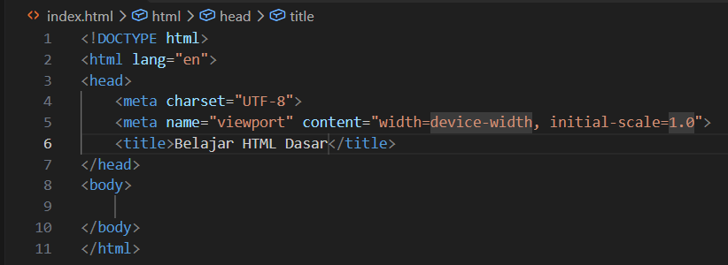

**Penjelasan kode:**

- `<!DOCTYPE html>` menyatakan bahwa dokumen menggunakan standar HTML5.
- `<html lang="id">` merupakan elemen utama dokumen HTML dengan bahasa Indonesia.
- `<head>` berisi informasi tentang dokumen yang tidak ditampilkan sebagai konten utama halaman.
- `<meta charset="UTF-8">` menentukan encoding karakter agar teks dan simbol ditampilkan dengan benar.
- `<meta name="viewport">` membantu halaman menyesuaikan ukuran tampilan pada perangkat berbeda.
- `<title>` menentukan judul halaman yang muncul pada tab browser.
- `<body>` berisi seluruh konten yang ditampilkan pada halaman web.

Setelah selesai, simpan file menggunakan `Ctrl + S`.

Buka file `index.html` melalui browser dengan klik kanan pada file, kemudian pilih **Open with Live Server** jika ekstensi Live Server tersedia, atau buka file secara langsung melalui browser.

**Hasil yang diharapkan:** Browser menampilkan halaman kosong dengan judul tab "Belajar HTML Dasar".
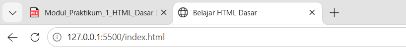

### Langkah 3 — Membuat Paragraf

Tambahkan kode berikut di dalam elemen `<body>`:

```html
<p>
    Kami sedang belajar HTML dasar pada mata kuliah
    Pemrograman Web.
    Praktikum ini digunakan untuk mengenal tag-tag dasar HTML.
</p>

<p>
    HTML digunakan untuk menyusun struktur dan konten halaman web.
    Browser akan menampilkan hasil interpretasi dari dokumen HTML.
</p>
```
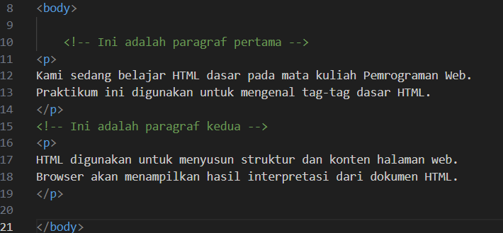

**Penjelasan:**

Tag `<p>` digunakan untuk membuat paragraf. Setiap elemen `<p>` akan ditampilkan sebagai blok teks tersendiri dengan jarak vertikal bawaan dari browser.

Dalam HTML, spasi dan pergantian baris di dalam kode biasanya diringkas menjadi satu spasi saat ditampilkan pada browser.

Simpan perubahan dan refresh browser.

**Hasil yang diharapkan:** Terdapat dua paragraf yang ditampilkan secara berurutan.
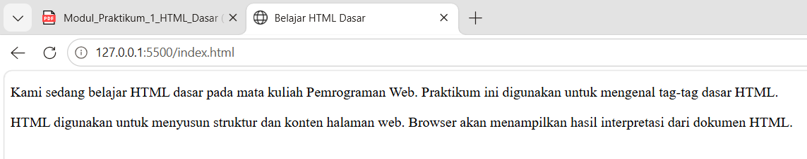

### Langkah 4 — Menambahkan Judul (Heading)

Tambahkan heading sebelum masing-masing paragraf:

```html
<h1>Belajar Dasar HTML</h1>

<p>
    Kami sedang belajar HTML dasar pada mata kuliah
    Pemrograman Web.
    Praktikum ini digunakan untuk mengenal tag-tag dasar HTML.
</p>

<h2>Paragraf pada HTML</h2>

<p>
    HTML digunakan untuk menyusun struktur dan konten halaman web.
    Browser akan menampilkan hasil interpretasi dari dokumen HTML.
</p>
```
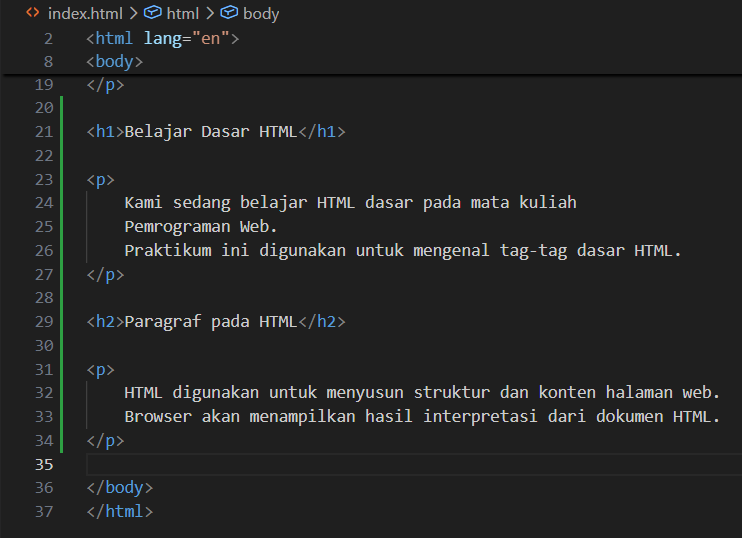

**Penjelasan:**

Heading digunakan untuk menentukan judul dan subjudul pada halaman web.

HTML menyediakan enam tingkatan heading:

- `<h1>` digunakan untuk judul utama halaman.
- `<h2>` digunakan untuk subjudul.
- `<h3>` digunakan untuk subbagian dari h2.
- `<h4>` digunakan untuk subbagian dari h3.
- `<h5>` digunakan untuk subbagian dari h4.
- `<h6>` merupakan tingkatan heading paling rendah.

Heading sebaiknya digunakan berdasarkan hierarki informasi, bukan hanya untuk memperbesar ukuran tulisan.
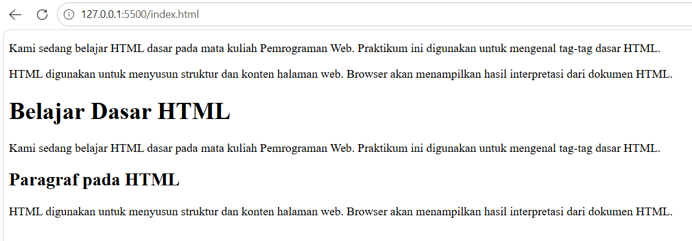


### Langkah 5 — Memformat Teks

Tambahkan beberapa paragraf untuk mencoba format teks:
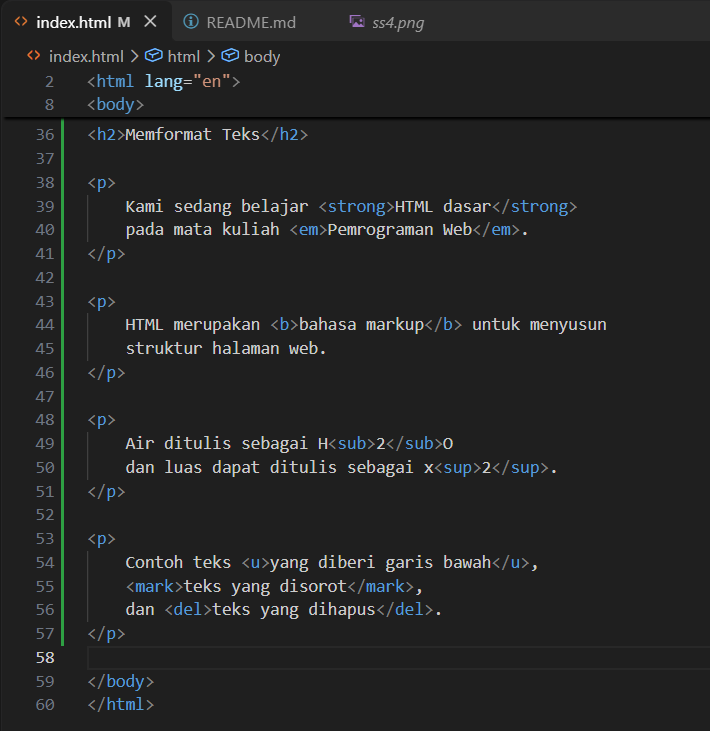

```html
<h2>Memformat Teks</h2>

<p>
    Kami sedang belajar <strong>HTML dasar</strong>
    pada mata kuliah <em>Pemrograman Web</em>.
</p>

<p>
    HTML merupakan <b>bahasa markup</b> untuk menyusun
    struktur halaman web.
</p>

<p>
    Air ditulis sebagai H<sub>2</sub>O
    dan luas dapat ditulis sebagai x<sup>2</sup>.
</p>

<p>
    Contoh teks <u>yang diberi garis bawah</u>,
    <mark>teks yang disorot</mark>,
    dan <del>teks yang dihapus</del>.
</p>
```
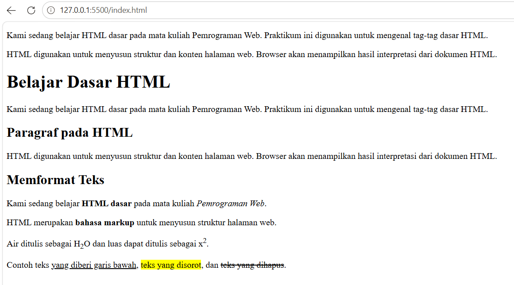

**Penjelasan tag pemformatan:**

| Tag | Fungsi |
|---|---|
| `<strong>` | Menandai teks yang memiliki tingkat kepentingan tinggi, biasanya ditampilkan tebal. |
| `<b>` | Menampilkan teks tebal tanpa menambahkan makna kepentingan. |
| `<em>` | Memberikan penekanan pada teks, biasanya ditampilkan miring. |
| `<i>` | Menampilkan teks miring untuk tujuan tertentu. |
| `<u>` | Memberikan garis bawah pada teks. |
| `<mark>` | Menyorot teks. |
| `<del>` | Menandai teks yang dihapus. |
| `<sub>` | Menampilkan teks sebagai subskrip, misalnya H₂O. |
| `<sup>` | Menampilkan teks sebagai superskrip, misalnya x². |

Tag `<strong>` dan `<em>` memberikan makna semantik pada teks, sedangkan `<b>` dan `<i>` lebih berfokus pada penyajian teks.

### Langkah 6 — Menyisipkan Gambar

Buat folder bernama `images` di dalam folder proyek.

Masukkan foto profil ke folder tersebut dan beri nama `profil.jpg`.

Tambahkan kode berikut di dalam `index.html`:
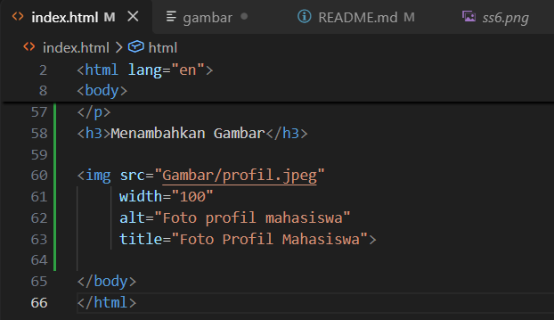

```html
<h2>Menambahkan Gambar</h2>


```
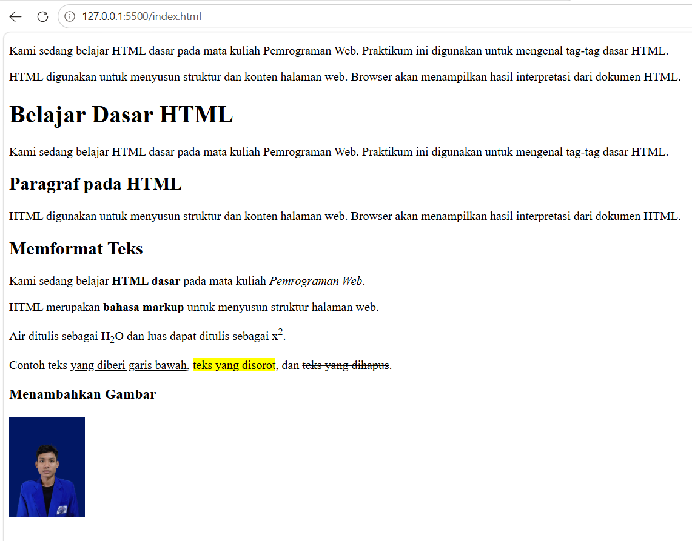

**Penjelasan:**

Tag `` digunakan untuk menampilkan gambar pada halaman web.

Atribut yang digunakan:

- `src` menentukan lokasi atau path file gambar.
- `alt` memberikan teks alternatif apabila gambar tidak dapat ditampilkan dan membantu aksesibilitas.

Path `images/profil.jpg` menunjukkan bahwa gambar berada di dalam folder `images` yang sejajar dengan file `index.html`.

Jika gambar tidak muncul, periksa nama file, ekstensi, dan lokasi gambar.

### Langkah 7 — Mengatur Ukuran Gambar

Ubah kode gambar menjadi:

```html
<h2>Mengatur Ukuran Gambar</h2>


```

**Penjelasan:**

Atribut `width` digunakan untuk menentukan lebar gambar, sedangkan `height` menentukan tinggi gambar.

Nilai pada contoh menggunakan satuan piksel secara default.

Jika gambar asli tidak memiliki rasio aspek 1:1, penentuan lebar dan tinggi secara bersamaan dapat membuat gambar terlihat melebar atau gepeng.

Untuk menjaga rasio gambar, kita juga dapat menggunakan CSS:

```html

```

### Langkah 8 — Menambahkan Hyperlink

Buat file baru dengan nama `halaman2.html`.

Masukkan struktur HTML berikut:

```html
<!DOCTYPE html>
<html lang="id">
<head>
    <meta charset="UTF-8">
    <meta name="viewport" content="width=device-width, initial-scale=1.0">
    <title>Halaman 2</title>
</head>
<body>

    <h1>Halaman Kedua</h1>

    <p>
        Ini adalah halaman kedua pada praktikum HTML dasar.
    </p>

    <a href="index.html">Kembali ke Beranda</a>

</body>
</html>
```

Selanjutnya, tambahkan hyperlink berikut ke dalam `index.html`:

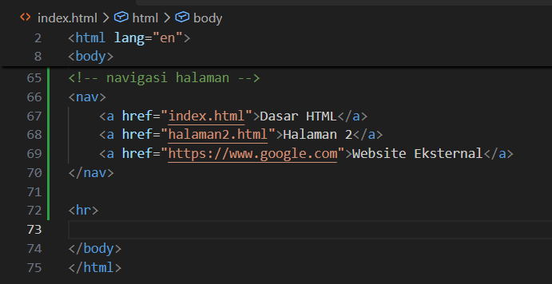

```html
<h2>Contoh Hyperlink</h2>

<a href="index.html">Dasar HTML</a>
<br>

<a href="halaman2.html">Halaman 2</a>
<br>

<a href="https://www.google.com">
    Website Eksternal
</a>
```
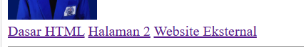

**Penjelasan:**

Tag `<a>` atau anchor digunakan untuk membuat hyperlink.

Atribut `href` menentukan tujuan tautan.

Terdapat dua jenis hyperlink pada contoh:

1. Hyperlink internal: menghubungkan halaman dalam satu proyek, seperti `halaman2.html`.
2. Hyperlink eksternal: menghubungkan ke website lain, seperti `https://www.google.com`.

Tag `<br>` digunakan untuk membuat pergantian baris.

Uji setiap hyperlink dengan membuka halaman utama dan mengklik tautan yang tersedia.

### Langkah 9 — Menambahkan List

Tambahkan kode berikut untuk membuat daftar keahlian dan urutan belajar:

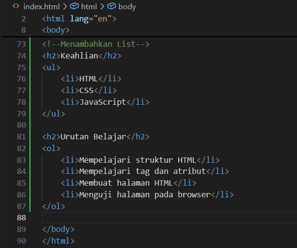

```html
<h2>Keahlian</h2>

<ul>
    <li>HTML</li>
    <li>CSS</li>
    <li>JavaScript</li>
</ul>

<h2>Urutan Belajar</h2>

<ol>
    <li>Mempelajari struktur HTML</li>
    <li>Mempelajari tag dan atribut</li>
    <li>Membuat halaman HTML</li>
    <li>Menguji halaman pada browser</li>
</ol>
```

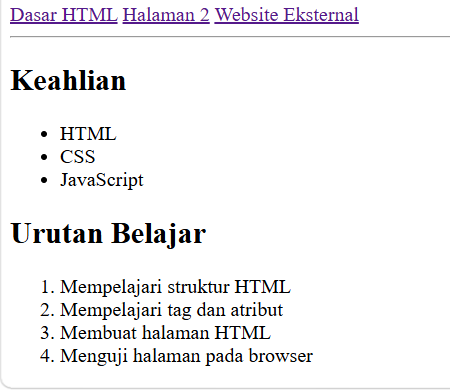

**Penjelasan:**

HTML memiliki dua jenis list utama:

- `<ul>` (Unordered List) digunakan untuk daftar tanpa urutan tertentu, biasanya ditampilkan dengan bullet.
- `<ol>` (Ordered List) digunakan untuk daftar berurutan, biasanya ditampilkan dengan nomor.
- `<li>` (List Item) digunakan untuk setiap item di dalam daftar.

List membantu menyajikan informasi agar lebih terstruktur dan mudah dibaca.

### Langkah 10 — Menambahkan Komentar

Tambahkan komentar pada bagian kode HTML:

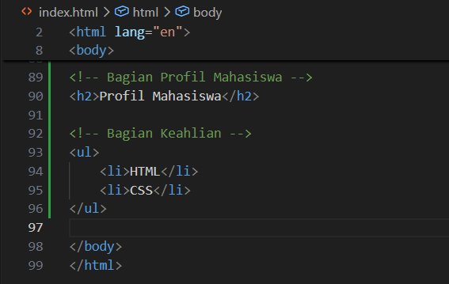

```html
<!-- Bagian Profil Mahasiswa -->

<h2>Profil Mahasiswa</h2>

<!-- Daftar keahlian mahasiswa -->

<ul>
    <li>HTML</li>
    <li>CSS</li>
</ul>
```
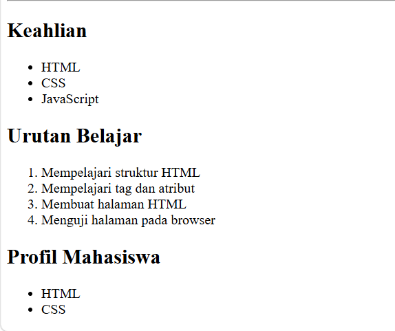

**Penjelasan:**

Komentar HTML ditulis menggunakan sintaks `<!-- ... -->`.

Komentar berfungsi untuk memberikan catatan atau penjelasan pada kode. Komentar tidak ditampilkan sebagai konten halaman pada browser.

Komentar dapat membantu programmer memahami fungsi bagian kode tertentu dan mempermudah proses pemeliharaan program.

Komentar HTML bukan mekanisme untuk menyimpan informasi rahasia karena isi komentar tetap dapat dilihat melalui kode sumber halaman.

### Langkah 11 — Menggabungkan Semua Elemen

Pada tahap terakhir, gabungkan seluruh elemen yang telah dipelajari menjadi halaman Profil Mahasiswa.

Ganti isi file `index.html` dengan kode berikut:

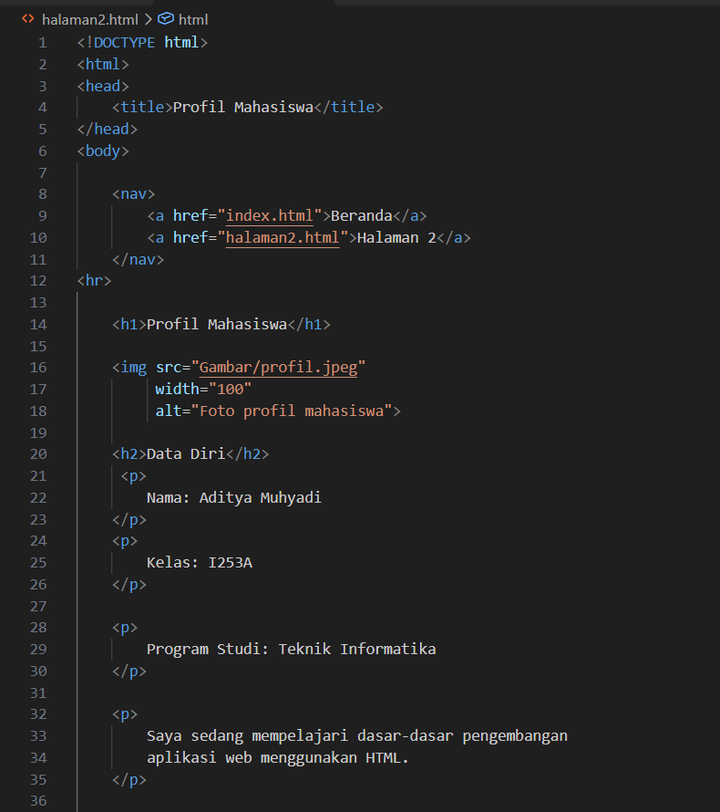
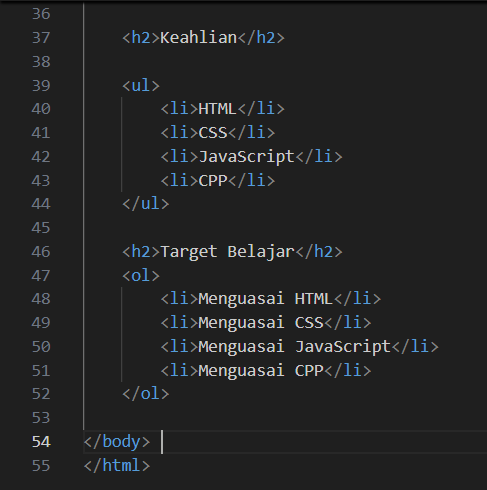

```html
<!DOCTYPE html>
<html lang="id">
<head>
    <meta charset="UTF-8">
    <meta name="viewport" content="width=device-width, initial-scale=1.0">
    <title>Profil Mahasiswa</title>
</head>
<body>

    <!-- Navigasi halaman -->

    <nav>
        <a href="index.html">Beranda</a>
        |
        <a href="halaman2.html">Halaman 2</a>
    </nav>

    <hr>

    <!-- Judul halaman -->

    <h1>Profil Mahasiswa</h1>

    <!-- Foto profil -->

    

    <!-- Data diri mahasiswa -->

    <h2>Data Diri</h2>

    <p>
        <strong>Nama:</strong> Nama Mahasiswa
    </p>

    <p>
        <strong>Program Studi:</strong> Teknik Informatika
    </p>

    <p>
        Saya sedang mempelajari dasar-dasar pengembangan
        aplikasi web menggunakan HTML.
    </p>

    <!-- Daftar keahlian -->

    <h2>Keahlian</h2>

    <ul>
        <li>HTML</li>
        <li>CSS</li>
        <li>JavaScript</li>
    </ul>

    <!-- Target belajar -->

    <h2>Target Belajar</h2>

    <ol>
        <li>Menguasai HTML</li>
        <li>Menguasai CSS</li>
        <li>Menguasai JavaScript</li>
    </ol>

    <!-- Tautan eksternal -->

    <h2>Referensi Belajar</h2>

    <p>
        <a href="https://www.google.com">
            Website Google
        </a>
    </p>

    <hr>

    <footer>
        <p>Praktikum 1 - Pemrograman Web</p>
        <p>Universitas Pelita Bangsa</p>
    </footer>

</body>
</html>
```
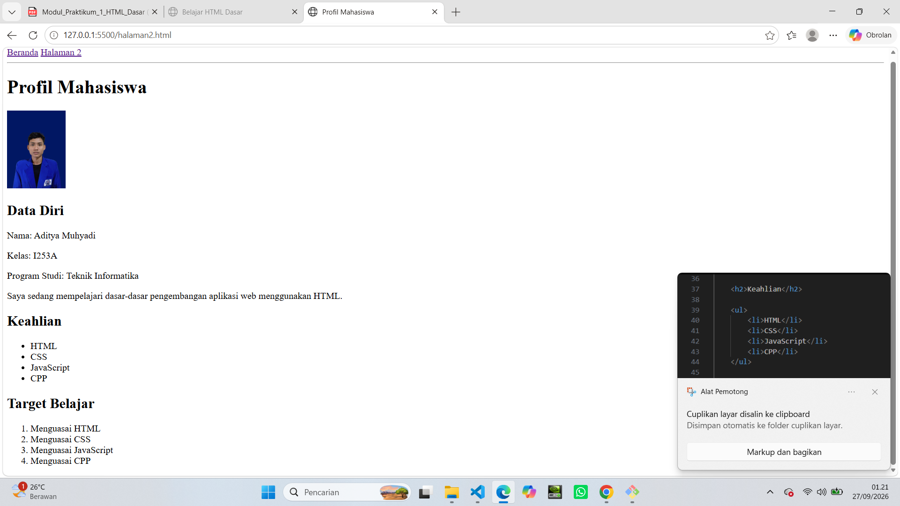

**Penjelasan:**

Pada tahap ini, seluruh elemen HTML digabungkan menjadi satu halaman yang memiliki struktur lebih lengkap.

Halaman terdiri dari navigasi, judul, gambar profil, data diri, daftar keahlian, target belajar, tautan eksternal, dan footer.

Ganti teks `Nama Mahasiswa` dengan nama kamu sendiri. Sesuaikan juga foto profil dengan gambar yang kamu miliki.

File `halaman2.html` tetap digunakan untuk menguji navigasi antarhalaman.

## 6. Hasil Praktikum

Setelah semua tahap selesai, hasil praktikum berupa halaman web Profil Mahasiswa yang memuat:

- Judul dan subjudul menggunakan heading.
- Paragraf informasi mahasiswa.
- Gambar profil.
- Informasi data diri.
- Daftar keahlian menggunakan unordered list.
- Target belajar menggunakan ordered list.
- Hyperlink internal dan eksternal.
- Navigasi antarhalaman.
- Komentar dan struktur HTML yang terorganisasi.

### Dokumentasi Screenshot

Simpan screenshot setiap tahap praktikum ke dalam folder `screenshots/`.

Struktur folder dokumentasi:

```text
praktikum-1-html-dasar/
│
├── index.html
├── halaman2.html
├── README.md
├── images/
│   └── profil.jpg
│
└── screenshots/
    ├── 01-struktur-html.png
    ├── 02-paragraf.png
    ├── 03-heading.png
    ├── 04-format-teks.png
    ├── 05-gambar.png
    ├── 06-hyperlink.png
    ├── 07-list.png
    └── 08-profil-mahasiswa.png
```

Screenshot diambil dari tampilan browser setelah setiap tahap selesai.

Jika ingin menampilkan screenshot pada README, gunakan sintaks Markdown berikut:

```markdown
### Hasil Struktur HTML


### Hasil Paragraf


### Hasil Profil Mahasiswa

```

Pastikan gambar screenshot benar-benar sudah disimpan di folder `screenshots` agar dapat ditampilkan pada GitHub.

## 7. Validasi HTML

Validasi dilakukan untuk memeriksa apakah struktur HTML sudah sesuai dengan standar HTML yang berlaku.

Langkah-langkah:

1. Buka file `index.html` di Visual Studio Code.
2. Salin seluruh kode HTML.
3. Buka website [W3C Markup Validation Service](https://validator.w3.org/).
4. Pilih tab **Validate by Direct Input**.
5. Tempelkan kode HTML ke kolom yang tersedia.
6. Klik tombol **Check**.
7. Periksa hasil validasi dan perbaiki kesalahan jika ditemukan.

**Penjelasan:**

W3C Validator digunakan untuk mendeteksi kesalahan sintaks atau struktur HTML, misalnya tag yang tidak ditutup, atribut yang tidak valid, dan penggunaan elemen yang tidak sesuai standar.

Hasil validasi yang tidak menunjukkan error menandakan bahwa dokumen lolos dari pemeriksaan kesalahan yang dapat dideteksi validator. Hal tersebut tidak otomatis menjamin bahwa tampilan halaman sudah sempurna atau seluruh aspek aksesibilitas telah terpenuhi.

Lakukan validasi terhadap `halaman2.html` secara terpisah.

## 8. Jawaban Pertanyaan Praktikum

### 1. Apa fungsi deklarasi `<!DOCTYPE html>` pada dokumen HTML?

Deklarasi `<!DOCTYPE html>` digunakan untuk memberitahu browser bahwa dokumen menggunakan standar HTML5.

Deklarasi ini membantu browser menampilkan halaman menggunakan mode standar (standards mode), sehingga tata letak halaman mengikuti aturan standar HTML dan CSS.

### 2. Apa perbedaan antara tag, elemen, dan atribut pada HTML?

- **Tag** adalah penanda yang ditulis menggunakan tanda kurung sudut, seperti `<p>` dan `</p>`.
- **Elemen** adalah keseluruhan struktur HTML yang terdiri dari tag pembuka, konten, dan tag penutup jika diperlukan.
- **Atribut** adalah informasi tambahan yang ditulis di dalam tag pembuka untuk mengatur karakteristik atau perilaku elemen.

Contoh:

```html
<a href="https://www.google.com">Google</a>
```

Pada contoh tersebut, `<a>` adalah tag pembuka, `</a>` adalah tag penutup, keseluruhan tautan merupakan elemen, dan `href` merupakan atribut.

### 3. Apa perbedaan `<strong>` dengan `<b>` dan `<em>` dengan `<i>`? Jelaskan penggunaannya.

`<strong>` digunakan untuk menandai teks yang penting secara semantik dan biasanya ditampilkan tebal.

`<b>` digunakan untuk menampilkan teks tebal tanpa memberikan makna tingkat kepentingan yang sama seperti `<strong>`.

`<em>` digunakan untuk memberikan penekanan pada teks, biasanya ditampilkan miring.

`<i>` digunakan untuk teks yang memiliki suara atau suasana berbeda, istilah teknis, atau istilah asing, tanpa memberikan penekanan semantik seperti `<em>`.

Contoh:

```html
<p><strong>Penting:</strong> Simpan file HTML.</p>

<p><b>HTML</b> adalah bahasa markup.</p>

<p>Saya sedang belajar <em>Pemrograman Web</em>.</p>

<p>Istilah <i>HyperText Markup Language</i> adalah kepanjangan HTML.</p>
```

### 4. Apa fungsi atribut `href` pada tag `<a>`?

Atribut `href` digunakan untuk menentukan alamat atau tujuan hyperlink.

Contoh:

```html
<a href="halaman2.html">Halaman 2</a>
```

Ketika tautan diklik, browser akan membuka halaman `halaman2.html`.

### 5. Apa perbedaan hyperlink ke halaman internal dengan hyperlink ke website eksternal?

Hyperlink internal digunakan untuk berpindah ke halaman lain dalam satu proyek atau website.

Contoh:

```html
<a href="halaman2.html">Halaman 2</a>
```

Hyperlink eksternal digunakan untuk membuka halaman pada website lain.

Contoh:

```html
<a href="https://www.google.com">Google</a>
```

Perbedaannya terletak pada tujuan tautan dan alamat yang digunakan.

### 6. Apa fungsi atribut `src` dan `alt` pada tag gambar?

Atribut `src` digunakan untuk menentukan lokasi file gambar yang akan ditampilkan.

Atribut `alt` digunakan untuk menyediakan teks alternatif yang menjelaskan gambar, terutama jika gambar tidak dapat dimuat atau ketika halaman diakses menggunakan pembaca layar.

Contoh:

```html

```

### 7. Apa perbedaan penggunaan `<ul>` dan `<ol>`?

`<ul>` digunakan untuk membuat daftar tanpa urutan tertentu dan biasanya menampilkan bullet.

`<ol>` digunakan untuk membuat daftar berurutan dan biasanya menampilkan nomor.

Keduanya menggunakan tag `<li>` untuk mendefinisikan setiap item daftar.

### 8. Apa yang terjadi jika path gambar pada atribut `src` salah?

Jika path gambar salah atau file tidak ditemukan, browser tidak dapat menampilkan gambar tersebut.

Browser biasanya menampilkan ikon gambar rusak dan dapat menampilkan teks alternatif dari atribut `alt`.

Contoh path yang benar:

```html

```

Pastikan nama folder, nama file, dan ekstensi sesuai dengan file yang sebenarnya.

### 9. Mengapa struktur heading h1 sampai h6 perlu digunakan secara terstruktur?

Heading digunakan untuk membangun hierarki informasi pada halaman web.

Penggunaan heading secara terstruktur membantu pembaca memahami susunan konten, memudahkan navigasi menggunakan teknologi bantu, dan membantu mesin pencari memahami struktur informasi.

Urutan heading sebaiknya mengikuti tingkat kepentingan informasi, bukan sekadar ukuran teks.

### 10. Apa fungsi komentar `<!-- ... -->` dalam kode HTML?

Komentar digunakan untuk memberikan catatan, penjelasan, atau penanda bagian kode HTML.

Komentar tidak ditampilkan sebagai konten halaman pada browser, tetapi tetap dapat dilihat melalui kode sumber halaman.

Contoh:

```html
<!-- Bagian data diri mahasiswa -->

<h2>Data Diri</h2>
```

Komentar membantu programmer memahami dan memelihara kode, terutama ketika dokumen HTML semakin panjang.

## 9. Kesimpulan

Berdasarkan praktikum HTML Dasar, dapat disimpulkan bahwa HTML merupakan bahasa markup yang digunakan untuk menyusun struktur dan konten halaman web.

Melalui praktikum ini, mahasiswa mempelajari penggunaan elemen dasar HTML, seperti heading, paragraf, pemformatan teks, gambar, hyperlink, list, dan komentar.

Seluruh elemen tersebut dapat digabungkan untuk membuat halaman Profil Mahasiswa sederhana yang dapat ditampilkan melalui web browser.

Validasi menggunakan W3C Validator membantu memeriksa kesesuaian struktur dokumen dengan standar HTML.

Praktikum ini menjadi dasar untuk mempelajari CSS sebagai bahasa untuk mengatur tampilan halaman web dan JavaScript untuk menambahkan interaktivitas.

---

**Mata Kuliah:** Pemrograman Web  
**Praktikum:** 1 — HTML Dasar  
**Program Studi:** Teknik Informatika  
**Universitas:** Universitas Pelita Bangsa